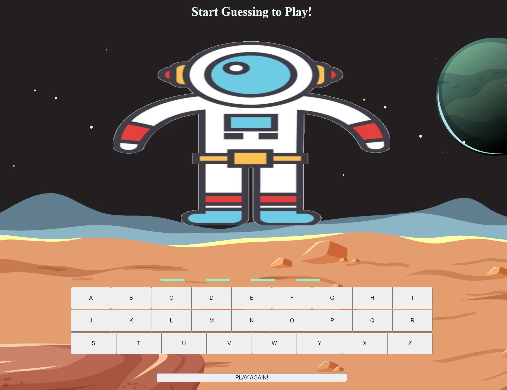
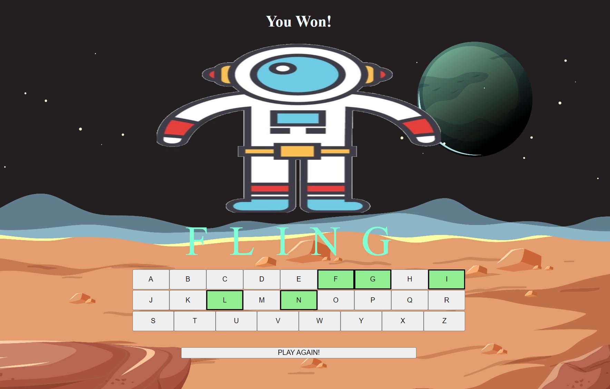

# SPACEMAN GAME

> Guess the word before the spaceman gets lost in space!  

### How the game works

   - Every wrong guess brings the spaceman closer to disapearing.
   - You win by getting all the letters in the word right before you run out of guesses. 
   - Hit play again to try another word

### The Game Look

### Technologies Used
  - JavaScript
  - HTML
  - CSS

### Getting Started

Click to Play: [Play SpaceMan](https://jpscodes.github.io/suitMan/)

### Icebox Features
- Add selection message allowing user to pick word theme upon game initializtion 
- Add hint message for users

#### References

Background Image by **brgfx** on Freepik